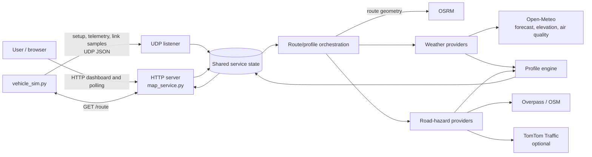
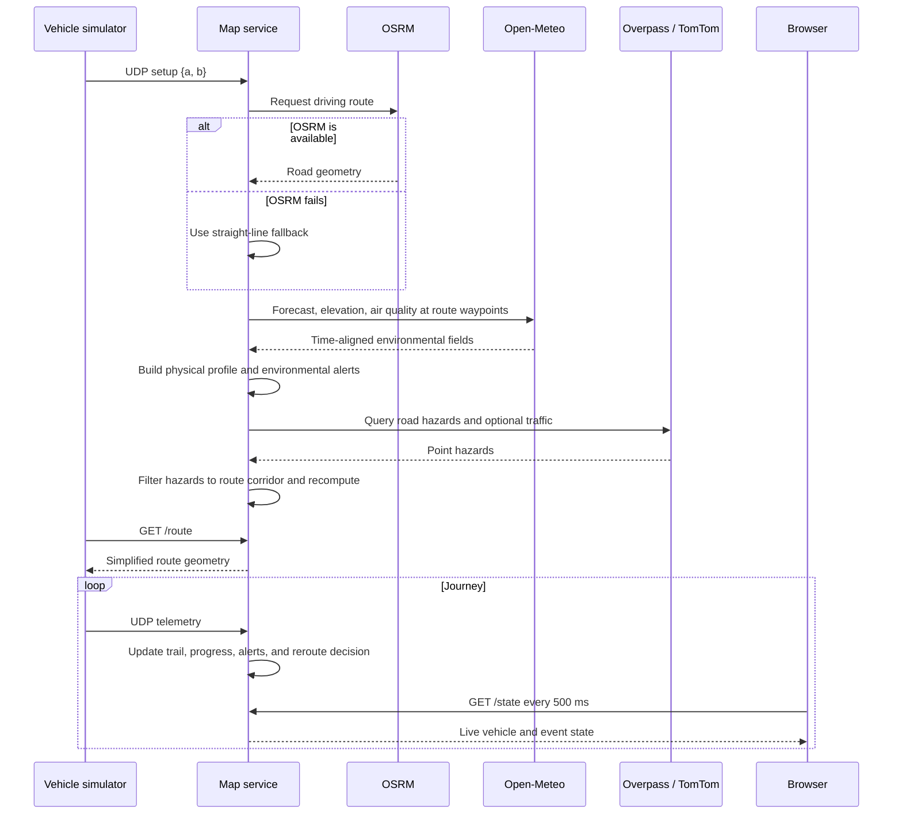
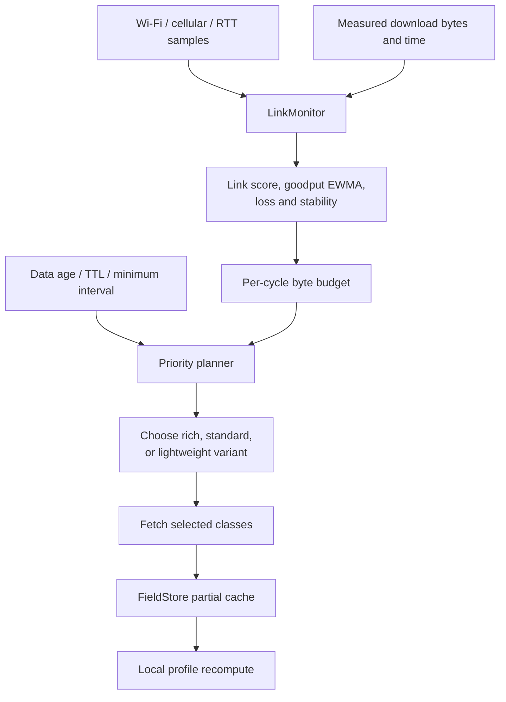

# HelioRoute

HelioRoute is a route-awareness and strategy prototype for solar-powered vehicles.
It turns a start point and destination into a live journey view that combines
the road ahead, weather conditions, predicted vehicle performance, road
hazards, and simulated vehicle telemetry.

The project is intended for solar-car teams, strategy engineers, researchers,
students, and developers evaluating route-based forecasting. It helps answer
practical questions such as: Where will headwind reduce speed? Where will solar
charging be weak? Which hazardous conditions are ahead? Is the vehicle still on
the planned road? Unlike a conventional weather map, HelioRoute aligns every input
to the route and the vehicle's expected arrival time, then translates those
inputs into speed, energy, and proximity-aware alerts.

HelioRoute is a prototype, not a certified navigation or safety system. It is most
useful as an understandable, testable foundation for strategy experiments and
live demonstrations.

## Table of contents

- [What HelioRoute does](#what-helioroute-does)
- [System architecture](#system-architecture)
- [How a journey is processed](#how-a-journey-is-processed)
- [Repository structure](#repository-structure)
- [Requirements and dependencies](#requirements-and-dependencies)
- [Installation](#installation)
- [Quick start](#quick-start)
- [Configuration](#configuration)
- [Using the simulator](#using-the-simulator)
- [HTTP API](#http-api)
- [UDP message protocol](#udp-message-protocol)
- [Weather, physics, and alert logic](#weather-physics-and-alert-logic)
- [Adaptive network scheduler](#adaptive-network-scheduler)
- [Testing and performance evaluation](#testing-and-performance-evaluation)
- [Development workflow](#development-workflow)
- [Logging and generated data](#logging-and-generated-data)
- [Security and operational considerations](#security-and-operational-considerations)
- [Known limitations](#known-limitations)
- [Troubleshooting](#troubleshooting)
- [Potential future work](#potential-future-work)

## What HelioRoute does

The live application provides:

- road routing through the public OSRM service, with a straight-line fallback;
- route-aware weather from Open-Meteo, blending ECMWF, GFS, and ICON forecasts;
- elevation and air-quality data sampled along the route;
- optional live traffic incidents from TomTom;
- construction and hazard discovery through OpenStreetMap/Overpass;
- a per-kilometre vehicle-performance profile based on wind, road grade,
  rolling resistance, aerodynamic drag, solar input, and battery power;
- alerts for rain, gusts, crosswind, dust, weak solar input, extreme heat, and
  road hazards;
- live UDP telemetry, progress tracking, route-deviation detection, and
  automatic rerouting;
- a browser dashboard with the route, vehicle trail, conditions, alerts, and
  browser notifications;
- an optional scheduler that reduces or defers downloads when connectivity is
  weak or intermittent;
- deterministic offline unit, system, and KPI test suites.

The core runtime uses only the Python standard library. The dashboard uses
Leaflet in the browser and loads Leaflet, CARTO map tiles, and fonts from public
CDNs at runtime.

## System architecture

HelioRoute consists of two executable processes:

1. `map_service.py` owns the route, weather/profile state, background refresh
   workers, UDP receiver, and HTTP dashboard/API.
2. `vehicle_sim.py` resolves locations, sends the journey setup and telemetry
   over UDP, and follows the road geometry returned by the service.



### Component responsibilities

| Component | Responsibility |
| --- | --- |
| `map_service.py` | Orchestrates routes and refreshes, validates UDP messages, protects shared state, exposes HTTP endpoints, and embeds the dashboard UI. |
| `vehicle_sim.py` | Geocodes endpoints, requests the computed road geometry, advances a simulated vehicle along it, and emits telemetry. |
| `profile_engine.py` | Resamples route geometry, computes physical performance and ETA, and groups environmental alerts into route sections. |
| `weather_providers.py` | Selects route waypoints, queries Open-Meteo, blends forecast models, caches elevation, and interpolates fields onto the complete profile. |
| `road_hazards.py` | Queries Overpass and optional TomTom incidents, normalizes them, and tracks downloaded bytes. |
| `comm_scheduler.py` | Scores connectivity, assigns a byte budget, selects data variants, handles backoff/circuit breaking, and merges partial downloads. |
| `geo_utils.py` | Provides shared geodesic distance, bearing, route simplification, and point-to-route distance functions. |
| `alert_policy.py` | Calculates proximity windows and notification priority independently from service I/O. |
| `service_config.py` | Defines and validates service command-line configuration. |
| `service_state.py` | Creates the canonical in-memory service-state schema. |
| `service_models.py` | Defines the typed result returned by adaptive download executors. |

The service uses a shared state dictionary protected by a `threading.Lock`.
Network and CPU-heavy work is performed outside that lock. Route request and
route publication revisions prevent an older background worker from replacing
newer route data.

## How a journey is processed



### Data flow

1. A `setup` message supplies validated origin and destination coordinates.
2. OSRM returns a driving route. If it fails, the service remains usable with a
   straight line and periodically attempts to obtain a real route again.
3. The route is sampled at global, evenly spaced distances. Forecast waypoints
   are chosen more sparsely to control API cost.
4. Forecast data is selected for each waypoint's estimated arrival time and
   blended across available models. Elevation and dust are added separately.
5. The profile engine projects wind onto route heading, estimates available
   solar/battery power, solves achievable speed, applies acceleration/deceleration
   constraints, and calculates ETA.
6. Environmental alerts and point hazards are merged and ordered by route
   distance. Only nearby, relevant alerts become live notification events.
7. Telemetry updates the vehicle, trail, current profile values, and rerouting
   logic. The dashboard polls this state and refreshes the profile when its
   version changes.

## Repository structure

```text
HelioRoute/
├── .github/workflows/ci.yml     Cross-platform offline CI
├── artifacts/                   Generated evaluation reports (ignored)
├── sounds/                      Reserved directory; unused by current runtime
├── alert_policy.py              Alert proximity and priority policy
├── comm_scheduler.py            Adaptive connectivity/download scheduler
├── console_utils.py             Encoding-safe console output
├── geo_utils.py                 Shared route and geodesic functions
├── geocode_cache.json           Persisted Nominatim lookup cache
├── kpi.py                       KPI definitions and measurements
├── map_service.py               Main live service and embedded dashboard
├── mocks.py                     Deterministic external-service mocks
├── profile_engine.py            Vehicle physics and alert detection
├── road_hazards.py              OSM/Overpass and TomTom integrations
├── run_evaluation.py            Console, JSON, and HTML KPI reporting
├── service_config.py            Validated CLI configuration
├── service_models.py            Shared typed result models
├── service_state.py             Canonical service-state factory
├── system_test.py               Offline end-to-end scenario
├── test_units.py                Offline regression suite
├── vehicle_sim.py               Telemetry and route-following simulator
├── weather_providers.py         Open-Meteo integration and model blending
├── pyproject.toml               Packaging, entry points, extras, Ruff config
└── README.md                    Project documentation
```


## Requirements and dependencies

### Required

- Python 3.11 or newer;
- a modern browser;
- internet access for a live route, live weather, hazards, base-map tiles, and
  unknown place-name geocoding.

No third-party Python package is required by the live application.

### Optional Python dependencies

The `prototype` compatibility extra declares scientific packages that were used
by earlier experiments, although those experiment files are not present in the
current workspace:

- NumPy;
- Requests;
- Xarray;
- cfgrib.

The `dev` extra installs Ruff. Tests themselves use `unittest` and need no
third-party testing framework.

### External services

| Service | Purpose | Required? | Runtime behavior when unavailable |
| --- | --- | --- | --- |
| Open-Meteo Forecast | Weather along the route | Needed for the normal live profile | Existing data is retained; errors/backoff are reported. |
| Open-Meteo Elevation | Route elevation | Needed for real elevation | Responses are cached in memory. |
| Open-Meteo Air Quality | Dust concentration | Optional/degradable | Normal full refresh substitutes zero dust on non-rate-limit failures. |
| OSRM public router | Driving geometry | Optional | A straight line is used and the service retries later. |
| Overpass / OpenStreetMap | Roadworks and hazards | Optional | The route/profile remain available without hazards. |
| TomTom Traffic | Live incidents and congestion | Optional, API key required | The TomTom layer is omitted. |
| Nominatim | Geocoding names unknown to the built-in gazetteer/cache | Optional | Direct `lat,lon` input still works. |
| CARTO and Leaflet CDNs | Browser map and UI library | Needed for the full visual dashboard | JSON APIs continue to work without tiles/UI assets. |

Public services have their own availability, rate, attribution, and usage
policies. This repository does not provision or operate them.

## Installation

There is no compilation step. Running the Python files directly is sufficient.
An editable installation is recommended because it also creates the
`helioroute-map`, `helioroute-sim`, and `helioroute-evaluate` commands.

### Windows PowerShell

```powershell
cd "C:\path\to\HelioRoute"
python -m venv .venv
.venv\Scripts\Activate.ps1
python -m pip install --upgrade pip
python -m pip install -e ".[dev]"
```

### Linux or macOS

```bash
cd /path/to/HelioRoute
python3 -m venv .venv
source .venv/bin/activate
python -m pip install --upgrade pip
python -m pip install -e '.[dev]'
```

To install that compatibility dependency set:

```powershell
python -m pip install -e ".[prototype,dev]"
```

## Quick start

Open two terminals in the repository with the virtual environment activated.

### 1. Start the service

```powershell
python map_service.py
```

Equivalent installed command:

```powershell
helioroute-map
```

Expected startup messages include:

```text
[udp] listening on 127.0.0.1:9999
[weather] live update every 900s
[http] map available at http://127.0.0.1:8000
```

Open <http://127.0.0.1:8000> in a browser.

### 2. Start the vehicle simulator

```powershell
python vehicle_sim.py "Bologna" "Modena" --speed 95
```

Equivalent installed command:

```powershell
helioroute-sim "Bologna" "Modena" --speed 95
```

The simulator sends the setup, waits for `/route`, follows that geometry, and
emits one telemetry sample per second by default. The dashboard becomes ready
after the first route and weather profile have been published.

### Coordinate-only/offline geocoding example

```powershell
python vehicle_sim.py "44.4949,11.3426" "44.6471,10.9252" --speed 80
```

This avoids a Nominatim lookup. Live routing and weather still require network
access unless they are mocked by the tests.

## Configuration

Run `python map_service.py --help` for the authoritative service options.

| Option | Default | Description |
| --- | ---: | --- |
| `--http-host` | `127.0.0.1` | HTTP bind address. |
| `--http-port` | `8000` | Dashboard/API port. |
| `--udp-host` | `127.0.0.1` | UDP bind address. |
| `--udp-port` | `9999` | UDP telemetry port. |
| `--weather-period` | `900` | Seconds between full weather refreshes. |
| `--hazard-period` | `900` | Seconds between hazard refreshes. |
| `--hazard-radius` | `300` | Overpass search radius around sampled route points, in metres. |
| `--tomtom-key` | unset | Enables TomTom traffic incidents. |
| `--nominal-kmh` | `90` | Speed used to estimate forecast arrival times. |
| `--adaptive` | off | Enables connectivity-aware data downloads. |
| `--adaptive-period` | `20` | Scheduler cycle time in seconds. |
| `--debug-scheduler` | off | Prints scheduler decision details. |
| `--reroute-m` | `120` | Off-route distance threshold in metres. |
| `--reroute-cooldown` | `30` | Minimum seconds between off-route reroutes. |
| `--no-reroute` | off | Disables fallback retries and off-route rerouting. |

Ports, periods, hazard radius, and nominal speed must be greater than zero.
HTTP and UDP bind only to loopback by default.

### TomTom key

The recommended service configuration is explicit:

```powershell
python map_service.py --tomtom-key "YOUR_TOMTOM_KEY"
```

`road_hazards.fetch_all()` can also read `TOMTOM_KEY` from the environment,
but the adaptive scheduler decides whether to enable its traffic class from the
CLI-configured key. Use `--tomtom-key` when running the application, especially
with `--adaptive`.

No other environment variables are consumed by the live code.

### Adaptive example

```powershell
python map_service.py --adaptive --debug-scheduler --tomtom-key "YOUR_KEY"
```

In the simulator terminal, generate realistic changing link samples:

```powershell
python vehicle_sim.py "Bologna" "Modena" --fake-link --seed 42
```

## Using the simulator

Run `python vehicle_sim.py --help` to inspect all options.

| Option | Default | Description |
| --- | ---: | --- |
| `city_a`, `city_b` | required | Place names known to the gazetteer/Nominatim, or `lat,lon`. |
| `--speed` | `95` | Initial target speed in km/h. |
| `--host` | `127.0.0.1` | Host used for UDP and HTTP service access. |
| `--udp-port` | `9999` | Destination UDP port. |
| `--http-port` | `8000` | Service port used to obtain `/route`. |
| `--rate` | `1.0` | Simulation time step and sleep interval in seconds. |
| `--accel` | `8.0` | Acceleration ramp in km/h per simulated second. |
| `--duration` | `0` | Stop after this many wall-clock seconds; zero means no time limit. |
| `--seed` | unset | Random seed for repeatable speed noise/link scenarios. |
| `--no-road` | off | Force direct straight-line movement. |
| `--fake-link` | off | Emit simulated Wi-Fi, cellular, RTT, and loss samples. |
| `--fake-link-period` | `5.0` | Seconds between simulated link samples. |

Interactive commands accepted while the simulator is running:

| Input | Effect |
| --- | --- |
| A number, for example `110` | Changes target cruise speed to 110 km/h. |
| `dest Ferrara` | Resolves a new destination and requests a new route from the current position. |
| `q`, `quit`, or `exit` | Stops the simulator. |

Resolved Nominatim names are atomically saved in `geocode_cache.json` for later
offline reuse. A small built-in Italian/Australian gazetteer is also available.

## HTTP API

The service exposes read-only endpoints. Query strings are accepted but route
matching uses the exact path. Unsupported paths return `404 not found`.

| Method | Path | Content type | Purpose |
| --- | --- | --- | --- |
| `GET` | `/`, `/index`, `/index.html` | `text/html` | Embedded Leaflet dashboard. |
| `GET` | `/state` | `application/json` | Live vehicle, trail, events, alerts, and current conditions. |
| `GET` | `/profile` | `application/json` | Route, complete per-kilometre profile, hazards, sources, and version. |
| `GET` | `/route` | `application/json` | Simplified route geometry used by the simulator. |

Every response includes `Cache-Control: no-store`. There are no POST, mutation,
authentication, health-check, or OpenAPI endpoints in the current codebase.

### `GET /route`

```json
{
  "ready": true,
  "geom": [[44.4949, 11.3426], [44.52, 11.28], [44.6471, 10.9252]]
}
```

`geom` is simplified for transport/display. The service retains the full route
geometry internally for route-aware calculations.

### `GET /state`

Representative fields:

```json
{
  "veh": {"name": "Bologna", "lat": 44.52, "lon": 11.28},
  "speed": 94.7,
  "heading": 275.0,
  "connected": true,
  "age": 0.4,
  "version": 2,
  "km": 8.0,
  "vPredHere": 101.2,
  "alongHere": -1.8,
  "pvHere": 642,
  "cloudHere": 25,
  "elevHere": 67.4,
  "alerts": [],
  "events": []
}
```

The endpoint also returns origin/destination, timestamp, message count, up to
2,000 recent trail points, source labels, weather status, and recent events.
The dashboard polls it every 500 ms.

### `GET /profile`

Before the first profile is ready:

```json
{
  "ready": false,
  "weatherOk": false,
  "weatherErr": null,
  "sources": []
}
```

Once ready, the response includes `a`, `b`, total `dist`, simplified `route`, a
downsampled `map` series, complete `cols`, normalized `hazards`, update time,
and `version`. Important `cols` arrays include:

| Field | Unit/meaning |
| --- | --- |
| `dist` | Cumulative route kilometres. |
| `lat`, `lon`, `elev` | Profile position and elevation in metres. |
| `grade` | Road grade in percent, clamped by the model to ±6%. |
| `vPred`, `vNoWind`, `dSpeed` | Predicted speed, no-wind speed, and wind effect in km/h. |
| `along`, `cross` | Along-route and cross-route wind at vehicle height in m/s. |
| `windSpeed`, `windDir`, `gust` | Forecast wind measurements. |
| `etaH` | Cumulative estimated travel time in hours. |
| `cloud`, `precip`, `dust`, `ghi`, `temp` | Environmental fields. |
| `pv` | Estimated solar-panel output in watts. |

## UDP message protocol

The UDP listener accepts UTF-8 JSON datagrams up to 65,535 bytes. Invalid JSON,
invalid coordinates, and unknown message types are logged and ignored; UDP has
no acknowledgement or delivery guarantee.

### Journey setup

```json
{
  "type": "setup",
  "a": {"name": "Bologna", "lat": 44.4949, "lon": 11.3426},
  "b": {"name": "Modena", "lat": 44.6471, "lon": 10.9252}
}
```

Coordinates must be finite and within WGS84 latitude/longitude ranges. Names
are converted to strings and limited to 160 characters.

### Telemetry

```json
{
  "type": "telem",
  "lat": 44.52,
  "lon": 11.28,
  "speed": 95.2,
  "heading": 274.8,
  "t": 1770000000.0
}
```

`speed` is interpreted as km/h by the current simulator and UI. `t` is a Unix
timestamp. The service keeps at most 6,000 trail points and considers telemetry
connected when the most recent message is less than five seconds old.

### Connectivity sample

```json
{
  "type": "link",
  "cell_type": "4g",
  "cell_dbm": -95,
  "rssi": -58,
  "mbps": 72,
  "rtt_ms": 90,
  "loss": 0.01
}
```

These samples are used only by the adaptive scheduler. Cellular types recognized
by its scorer are `none`, `2g`, `edge`, `3g`, `4g`, `lte`, and `5g`.

## Weather, physics, and alert logic

### Route sampling and weather blending

- The physical profile is sampled at 1 km by the live service, always including
  the route endpoint.
- Weather requests use a smaller set of evenly distributed waypoints: normally
  6–30 points at roughly 40 km spacing.
- Forecast hours are selected from remaining route distance and nominal speed,
  up to seven days.
- ECMWF, GFS, and ICON scalar fields are arithmetically averaged where present.
- Wind speed/direction are converted to vector components before averaging.
- Missing model values are skipped; a failed multi-model forecast is retried
  with Open-Meteo `best_match`.
- Sparse waypoint fields are linearly interpolated onto the complete route.

Elevation responses are held in a small in-memory cache. That cache is not
persisted between service runs.

### Vehicle model

The implementation uses a deliberately compact strategy model with:

- 250 kg mass;
- drag area (`CdA`) of 0.10 m²;
- rolling-resistance coefficient of 0.006;
- 4 m² solar-panel area at 24% nominal efficiency;
- a constant 2,200 W battery contribution;
- a maximum modeled speed of 130 km/h;
- wind scaled from the 10 m forecast reference height to a 1 m vehicle height;
- a binary-search speed solver and a time-step realization with acceleration
  and deceleration limits.

These constants are defined in `profile_engine.py`; they are not currently
runtime configuration options. The model is intended for comparative strategy,
not homologation or safety-critical control.

### Alert thresholds

| Alert | Severity 1 | Severity 2 | Severity 3 |
| --- | --- | --- | --- |
| Rain | precipitation ≥ 1 mm/h | precipitation ≥ 4 mm/h | ≥ 4 mm/h and gust ≥ 14 m/s |
| Gust | — | gust ≥ 17 m/s | gust ≥ 24 m/s |
| Crosswind | absolute crosswind ≥ 6 m/s | ≥ 9 m/s | — |
| Dust | dust ≥ 150 µg/m³ | ≥ 350 µg/m³ | — |
| Low solar | panel output < 250 W | — | — |
| Heat | temperature ≥ 40 °C | ≥ 45 °C | — |

Severity-1 weather spans shorter than 2 km are suppressed. Higher-severity
spans are retained regardless of length. OSM/TomTom hazards are converted to
point alerts after being filtered to a 400 m corridor around the road geometry.

Notification distance is not a fixed radius: `alert_policy.py` combines alert
type, severity, current speed, lead time, and distance. The map always displays
all alerts, while console/browser events are emitted only when relevant to the
vehicle. Browser system notifications require permission and are used for
severity 2 or higher.

## Adaptive network scheduler

Enable the scheduler with `--adaptive`. It is designed for a vehicle connected
through variable Wi-Fi/cellular links.



The planner handles five data classes:

- critical weather for the next 150 km;
- lower-priority whole-route weather;
- OSM hazards ahead;
- dust ahead;
- TomTom traffic ahead when a key is configured.

It learns payload size and goodput, uses exponentially weighted moving averages,
limits a cycle to 4 MB, and normally spends 60% of estimated capacity. After
three consecutive failures it opens a circuit breaker with exponential cooldown.
HTTP 429 responses honor at least a 60-second backoff. If the link is unusable,
the dashboard and alerts continue from the local `FieldStore`; synthetic fields
fill areas that have not yet been downloaded.

On Linux, the scheduler attempts to read `wlan0` from `/proc/net/wireless` and
the `iw` command. On Windows or when that interface is unavailable, it relies on
UDP `link` messages or the simulator's `--fake-link` mode.

## Testing and performance evaluation

All standard tests are deterministic and replace external services with local
mocks. They do not require internet access or API keys.

### Unit tests

```powershell
python -B test_units.py
```

The suite covers geometry and physics, provider blending and fallback, hazard
parsing, scheduler behavior, HTTP paths, input validation, route-worker races,
rerouting, simulator movement, state snapshots, and console encoding.

### End-to-end system test

```powershell
python -B system_test.py
```

This drives setup, route creation, profile generation, hazards, telemetry,
progress, weather refresh, and proximity events in-process with deterministic
providers.

### KPI evaluation

```powershell
python -B run_evaluation.py --output-dir artifacts
```

The evaluation runs the tests and measures alert precision/recall, weather
blend error, long-route profile latency, alert detection, `/state`, end-to-end
recompute latency, telemetry throughput, request efficiency, robustness, and
route-following fidelity. It writes:

- `artifacts/perf_report.html`;
- `artifacts/perf_report.json`.

Use `--no-write` for CI or a read-only evaluation:

```powershell
python -B run_evaluation.py --no-write
```

Although `pyproject.toml` currently declares a `helioroute-evaluate` console entry
point, `run_evaluation.main()` returns its result objects for programmatic use.
Depending on the generated launcher, that non-`None` return can be interpreted
as a non-zero process exit. Use the direct Python command above in scripts and
CI until the console wrapper is separated from the programmatic API.

Performance figures depend on the machine. The current report produced in this
workspace passed all 21 KPI targets; inspect the generated JSON/HTML for the
actual measurements rather than treating historical numbers as guarantees.

### Continuous integration

`.github/workflows/ci.yml` runs on every push and pull request across:

- Ubuntu and Windows;
- Python 3.11 and 3.12.

Each job installs the package and runs unit tests, the system test, and the KPI
evaluation without writing reports.

## Development workflow

Recommended local checks before submitting changes:

```powershell
python -m ruff check .
python -B test_units.py
python -B system_test.py
python -B run_evaluation.py --no-write
```

When changing a provider or network boundary, add a deterministic mock and a
failure-path regression test. When changing physics or profile algorithms,
compare numerical behavior and rerun the latency KPIs. When adding service
state, update `service_state.new_service_state()` so production and tests share
one schema.

The project favors a few explicit patterns:

- **Provider injection:** `profile_engine.build_profile()` accepts a field
  provider, allowing real, cached, or synthetic inputs.
- **Adapter normalization:** external weather/hazard payloads are converted into
  stable internal dictionaries before reaching the profile engine.
- **Revision guards:** asynchronous route-related results publish only if their
  captured route revision is still current.
- **Cache-as-provider:** adaptive downloads update `FieldStore`, which then acts
  as the profile provider without additional network calls.
- **Pure policy functions:** proximity and alert priority can be tested without
  service state or I/O.

There is currently no formal contribution guide, release process, or versioning
policy beyond the package version in `pyproject.toml`. This could not be
determined from the current codebase.

## Logging and generated data

Runtime logging is written directly to stdout with subsystem prefixes such as:

- `[udp]`, `[http]`, `[setup]`, `[route]`, `[reroute]`;
- `[weather]`, `[hazards]`, `[profile]`, `[adaptive]`;
- `[event]`, `[telem]`, `[fake-link]`.

`console_utils.safe_print()` prevents Unicode symbols from crashing legacy
Windows console encodings. There is no logging configuration, log rotation,
structured log sink, or persistent operational database.

Persistent/generated files are limited to:

- `geocode_cache.json`, updated by the simulator after successful Nominatim
  lookups;
- HTML/JSON evaluation reports;
- generated root reports retained from earlier evaluations.

Service state, elevation cache, scheduler history, trails, and events are held
in memory and disappear when the process stops.

## Security and operational considerations

- HTTP and UDP bind to `127.0.0.1` by default. This is the recommended mode for
  local use.
- Binding `--http-host 0.0.0.0` or `--udp-host 0.0.0.0` exposes unauthenticated
  endpoints. Use only on a trusted network or behind appropriate controls.
- UDP messages are not authenticated, encrypted, acknowledged, or protected
  against replay. Any sender that can reach the socket can change journey/live
  state.
- The HTTP API has no authentication or TLS and reveals route and vehicle data.
- TomTom keys passed on the command line may be visible to local process-listing
  tools. Secret-storage integration is not implemented.
- Dashboard labels derived from external/user data are escaped before insertion
  into generated UI elements, but the application has not undergone a formal
  security audit.
- Public API and tile usage must comply with each provider's terms and rate
  limits.

Do not use HelioRoute as the sole navigation, weather-warning, or vehicle-control
system.

## Known limitations

- The system is a single-process, in-memory service and has no durable journey
  database or restart recovery.
- The dashboard HTML/CSS/JavaScript remains embedded in `map_service.py` rather
  than being built as a separate frontend package.
- The public OSRM and Overpass endpoints are best-effort dependencies without a
  service-level agreement.
- Weather blending is a simple equal average of available models; it does not
  currently apply location-specific model skill or uncertainty bounds.
- Vehicle constants and alert thresholds are source-code constants rather than
  user profiles or configuration files.
- Route progress uses nearest profile-point matching. Complex self-intersecting
  routes may be ambiguous.
- Automatic off-route rerouting requires three consecutive out-of-corridor
  telemetry samples, but UDP loss and telemetry rate can change how long that
  takes in wall-clock time.
- The simulator interpolates latitude/longitude linearly within each road
  segment; it is adequate for dense route geometry but is not a full navigation
  dynamics model.
- The adaptive Linux Wi-Fi probe assumes an interface named `wlan0`.
- The declared `helioroute-evaluate` launcher may treat the evaluator's returned
  result tuple as a process error; use `python run_evaluation.py` instead.
- Root-level reports can be stale until the evaluation command regenerates them.
- No license file is present. Reuse and distribution terms could not be
  determined from the current codebase.

## Troubleshooting

### The dashboard opens but remains “not ready”

Start the simulator so the service receives a `setup` message. Then inspect the
service terminal for `[osrm]`, `[weather]`, or rate-limit errors. The dashboard can
show an existing profile during later refresh failures, but the first normal
profile needs valid weather data.

### OSRM is unavailable

The message below is expected fallback behavior:

```text
[osrm] unavailable (...); using a straight line from A to B
```

The service uses a straight line, marks the route as fallback, and retries
periodically unless `--no-reroute` is active.

### Open-Meteo returns HTTP 429

HelioRoute reads `Retry-After`, waits at least 120 seconds in the normal refresh
path, and keeps previously published data. Do not shorten refresh periods to
work around rate limiting.

### A place name cannot be resolved

Use direct coordinates:

```powershell
python vehicle_sim.py "44.4949,11.3426" "44.6471,10.9252"
```

The built-in gazetteer and `geocode_cache.json` work offline; new arbitrary
names require Nominatim access at least once.

### The simulator cannot connect

Confirm that service and simulator use matching `--host`, `--udp-port`, and
`--http-port` values. UDP setup has no acknowledgement, so start the service
first. Check local firewall rules if using different machines.

### The map has no tiles or controls

The dashboard depends on browser access to Leaflet and CARTO CDNs. Check the
browser developer console, proxy/firewall settings, and network connectivity.
The `/state`, `/profile`, and `/route` JSON endpoints do not depend on map tiles.

### Adaptive mode performs no downloads

Use `--debug-scheduler` and either provide real `link` messages or start the
simulator with `--fake-link`. A sample declaring cellular type `none` is treated
as no uplink when no successful goodput measurement is available. Fresh data,
active HTTP 429 backoff, or an open circuit breaker can also suppress downloads.

### Unicode symbols appear as `?` in PowerShell

The application deliberately replaces characters unsupported by the active
console encoding rather than failing. Use a UTF-8 terminal for the intended
symbols.

## Potential future work

The implementation suggests several practical next steps:

- move the embedded dashboard into versioned static assets and add frontend
  tests;
- introduce authenticated, encrypted telemetry and HTTP access;
- persist journeys, configuration profiles, and operational history;
- make vehicle parameters and alert thresholds validated configuration;
- add forecast uncertainty, source-skill weighting, and calibration;
- support configurable Linux network interfaces and native probes on Windows;
- provide private/self-hosted routing and hazard endpoints for production use;
- add health/metrics endpoints and structured logging;
- add a formal license, contribution guide, release policy, and deployment
  documentation.

Deployment topology, production hosting, hardware integration, and governance
requirements could not be determined from the current codebase.
